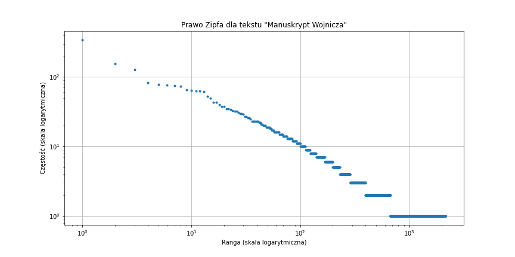

# Przetwarzanie języków naturalnych
Autorzy:
- Mateusz Woźniak
- Jakub Błażowski

Niniejszy dokument przedstawia analizę statystyczną wybranych tekstów:
- Dzieła "Cien años de soledad" autorstwa "Gabriel García Márquez" w języku hiszpańskim
- Manuskryptu Wojnicza w transliteracji FSG

Dla każdego tekstu:
- wykonano analizę pod kątem zgodności z prawem Zipfa
- stworzono tablicę n-gramów wraz z częstością występowania
- stworzono tablicę kolokacji (odpowiednik grafu dwudzielnego, gdzie krawędzie oznaczają sąsiedztwo dwóch unikatowych wyrazów

```python
import requests
import os
from collections import Counter,OrderedDict
import matplotlib.pyplot as plt

def calculate_zipf_law(words, name):
    word_counts = Counter(words)
    sorted_word_counts = sorted(word_counts.items(), key=lambda x: x[1], reverse=True)
    ranks = range(1, len(sorted_word_counts) + 1)
    frequencies = [count for word, count in sorted_word_counts]
    plt.figure(figsize=(12, 6))
    plt.loglog(ranks, frequencies, marker='.', linestyle='none')
    plt.xlabel('Ranga (skala logarytmiczna)')
    plt.ylabel('Częstość (skala logarytmiczna)')
    plt.title(f'Prawo Zipfa dla tekstu "{name}"')
    plt.grid(True)
    plt.show()

def print_n_grams(words):
    print('----------------')
    print('N-GRAMS analysis')
    def generate_n_grams(n):
        grams = []
        for i in range(len(words) - n+1):
            grams.append(' '.join(words[i:i+n]))
        return grams

    for r in range(2, 10):
        print(f'=> {r}-grams:')
        g = OrderedDict(Counter(generate_n_grams(r)).most_common())
        for k in g.keys():
            if g[k] > 1:
                print(f'{k}: {g[k]}')

def print_collocations(words):
    print('----------------')
    print('Collocations (graph) analysis')
    unique_words = list(set(words))
    collocations = {}
    for unique_word in unique_words:
        collocations[unique_word] = []
    for i in range(len(words) - 1):
        collocations[words[i]].append(words[i+1])
    print(collocations)
    for k, v in collocations.items():
        print(f'{k} occurs in { len(list(set(v)))} collocations')


def analysis(url, filename, name):
    print(f'Analysis for text: {name}')
    if not os.path.exists(filename) :
        r = requests.get(url)
        open(filename, 'wb').write(r.content)
    text = open(filename, 'r').read()
    text = text.replace('-', ',').replace('=', ',')
    text = text.split('# page 78')[0]
    lines = text.split('\n')
    words = []
    for line in lines:
        if not line.startswith('#'):
            for word in line.replace(',',' ').split(' '):
                if len(word) > 0:
                    words.append(word.strip())
    
    calculate_zipf_law(words, name)
    print_n_grams(words)
    print_collocations(words)
```

## Analiza manuskryptu Wojnicza
```python
analysis('https://www.ic.unicamp.br/~stolfi/voynich/mirror/reeds/docs/FSG.txt', 'fsg.txt','Manuskrypt Wojnicza')
```

1. Zgodność z Prawem Zipfa
Po obliczeniu wykresu poniżej, można stwierdzić, że tekst jest zgodny z prawem Zipfa.

2. Tablica N-Gramów
```
Analysis for text: Manuskrypt Wojnicza
----------------
N-GRAMS analysis
=> 2-grams:
TOE 8AM: 22
8AM 8AM: 10
TOR 8AM: 8
TOR TOE: 8
8AM HZG: 8
TG 8AM: 8
8AM HZOR: 8
TOE TOE: 7
8AM TOR: 7
...
```

[Cały plik](fsg-ngrams.txt)

3. Tablica kolokacji (graf sąsiedztwa)
```
DTRRR occurs in 1 collocations
ODAN8 occurs in 1 collocations
TOTG occurs in 2 collocations
OHCCOE occurs in 1 collocations
TG occurs in 54 collocations
OHTO8G occurs in 2 collocations
O8AIM occurs in 1 collocations
SDCCO occurs in 1 collocations
HTOE occurs in 7 collocations
SOHZG occurs in 7 collocations
O8SC occurs in 1 collocations
DTCOE occurs in 3 collocations
TOM occurs in 10 collocations
2OHTAM occurs in 1 collocations
TOHAM occurs in 5 collocations
O2OHZOR occurs in 1 collocations
```

[Cały plik](fsg-collocations.txt)
